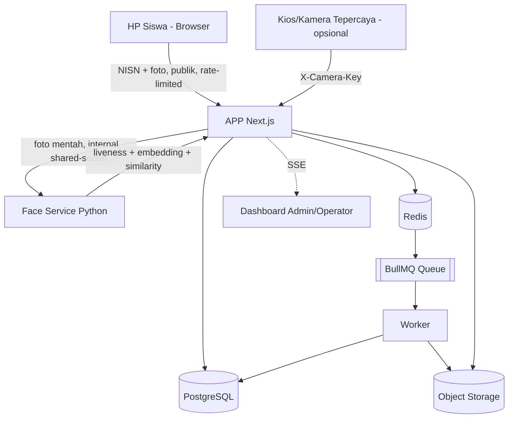

# 03 — Software Architecture Document (SAD)
## Sistem Absensi Biometrik Sekolah

---

## 1. Architecture Overview

Arsitektur terdiri dari APP (Next.js, stateless) yang di-hosting di server/cPanel sekolah, **Face Service** (Python, microservice terpisah, di server ke-2) untuk face embedding + liveness, PostgreSQL sebagai source of truth, Redis sebagai cache/rate-limit layer, queue+worker untuk pekerjaan asinkron, dan object storage untuk file/blob.

Client utama adalah **HP pribadi siswa** (browser, mengakses website presensi) — BUKAN kamera device tepercaya. Ini pergeseran penting dari asumsi awal (lihat §6 Trust Boundary): siswa mengetik NISN sendiri, kamera HP-nya mengambil foto, dan foto itu dikirim ke APP untuk diproses. APP TIDAK PERNAH mempercayai hasil liveness/kecocokan dari HP siswa — kedua nilai itu dihitung ulang oleh Face Service dari foto mentah.

Kamera/kios tepercaya (channel `KIOSK`) tetap didukung sebagai jalur OPSIONAL untuk perangkat yang benar-benar dikelola sekolah (API key device) — diagram di bawah menunjukkan keduanya.

Face Service TIDAK PERNAH diekspos ke internet publik — hanya dipanggil server-ke-server dari APP (lihat §6 Trust Boundary). Untuk topologi dua-server (APP di cPanel, Face Service di server terpisah), komunikasi antara keduanya melewati jaringan (bukan localhost) — WAJIB TLS atau setidaknya jaringan privat/VPN antar kedua server, bukan HTTP polos di internet terbuka (lihat 11-DEPLOYMENT.md §10).

## 2. Components & Responsibility

| Komponen | Tanggung Jawab |
|---|---|
| CDN | Menyajikan asset statis frontend, TLS termination opsional, mitigasi DDoS lapisan awal. |
| APP (Next.js) | Menyajikan UI dashboard, endpoint check-in publik untuk siswa, REST API admin, validasi request, autentikasi/otorisasi, publish event ke realtime channel. Stateless — tidak menyimpan session di memori lokal. |
| **Face Service (Python)** | **Komponen baru.** Microservice terpisah: face detection, quality check, liveness detection (MiniFASNet), generate + enkripsi embedding (InsightFace), perbandingan 1:1. Hanya dipanggil server-ke-server dari APP, tidak pernah dari browser siswa. Lihat `face-service/README.md` di kode sumber. |
| PostgreSQL | Source of truth seluruh data relasional (siswa, kelas, attendance, dst). |
| Redis | Cache (dashboard stats, session token lookup), rate limiting (termasuk rate limit check-in per NISN+IP), distributed lock, backend untuk BullMQ. Bukan source of truth. |
| Queue (BullMQ) | Menampung job asinkron: attendance-processing, notification, report-generation, data-sync, face-enrollment. |
| Worker | Mengeksekusi job dari queue: generate PDF, kirim notifikasi, proses sinkronisasi, proses enrolment. Stateless, dapat diskalakan independen. |
| Object Storage (S3-compatible) | Menyimpan file/blob: foto siswa (non-biometrik/ditampilkan di UI), foto enrolment sementara (dihapus setelah diproses), file hasil export, artifact backup. **Foto check-in TIDAK PERNAH ditulis ke sini** (lihat §6). |
| Realtime Channel (SSE) | Mendorong event kehadiran baru ke dashboard admin/operator yang terhubung. |

## 3. Communication & Data Flow

**Alur presensi utama (HP siswa — channel STUDENT_PHONE):**
1. Siswa buka website di HP, ketik NISN, kamera aktif, ambil foto. Foto dikirim ke `POST /api/attendance/checkin` (publik, rate-limited per NISN+IP — TIDAK ADA API key/password).
2. APP mencari siswa by NISN, ambil `embeddingRef` template tersimpan (biometric_profiles).
3. APP mengirim foto mentah ke Face Service (internal, shared-secret) → Face Service jalankan liveness check, generate embedding dari foto live, bandingkan 1:1 dengan template tersimpan → kembalikan hasil (passed/similarity) ke APP. Foto mentah TIDAK PERNAH ditulis ke Object Storage di jalur ini — diproses di memori, dibuang setelah request selesai.
4. Jika liveness gagal ATAU similarity < threshold (90%) → APP tolak dengan pesan generik, TIDAK mencatat kehadiran.
5. Jika lolos: APP menulis attendance ke PostgreSQL (source of truth) dalam transaksi, dengan unique constraint `(studentId, attendanceDate)` untuk mencegah race condition saat banyak siswa check-in bersamaan.
6. APP mem-publish event ke channel realtime (SSE) agar dashboard admin ter-update, dan mengenqueue job ringan tambahan (attendance-processing) ke BullMQ — tidak blocking response ke siswa.

**Alur presensi opsional (kios/kamera tepercaya — channel KIOSK):** sama seperti di atas, tapi lewat `POST /api/attendance` dengan autentikasi `X-Camera-Key` (device tepercaya milik sekolah, bukan HP siswa).

**Alur enrolment biometrik:** lihat 07-... (FR-ENROLL-001..006) — foto rapor diupload admin, disimpan SEMENTARA di Object Storage (bucket terisolasi), diproses async oleh worker (memanggil Face Service untuk quality check + generate embedding), foto dihapus permanen setelah selesai (berhasil maupun gagal).

**Alur sinkronisasi eksternal:** lihat 07-SYNC-SPEC.md.

**Alur export laporan:** APP menerima request export → validasi → enqueue job report-generation → worker generate PDF → upload ke object storage → update status job → APP/klien polling atau menerima event selesai → klien mengunduh via presigned URL.

## 4. Failure Modes

| Kegagalan | Dampak | Mitigasi |
|---|---|---|
| Redis down | Cache miss (performa turun), rate limiting fail-open untuk endpoint kritikal, realtime pub/sub terganggu | Backend tetap dapat menulis ke PostgreSQL langsung; dashboard fallback ke polling REST |
| PostgreSQL down | Pipeline presensi tidak dapat menulis data baru | Circuit breaker mengembalikan 503 dengan retry-after |
| **Face Service down/timeout** | **Siswa tidak bisa check-in sama sekali** (tidak ada fallback — liveness/similarity WAJIB dihitung server, tidak bisa diloncati demi keamanan) | Timeout eksplisit (15 detik) di sisi APP agar siswa tidak menunggu tanpa batas; alert operasional segera saat Face Service unreachable (ini kegagalan kritis, bukan degradasi ringan) |
| Worker crash | Job tertunda di queue | BullMQ retry otomatis dengan backoff; job idempotent sehingga aman diproses ulang |
| Object storage tidak tersedia | Export/laporan gagal, foto siswa tidak tampil, enrolment baru tertunda | Retry job export/enrolment; UI menampilkan placeholder untuk foto yang gagal dimuat |
| External sync source timeout | Data siswa/kelas menjadi stale | Sync log mencatat kegagalan, retry manual/terjadwal, data lokal tidak dihapus otomatis |

## 5. Scaling Strategy

- APP: horizontal scale jika beban tinggi — stateless, session/token divalidasi via database/Redis, bukan in-memory. Untuk skala awal (satu sekolah, cPanel), satu instance APP umumnya cukup.
- **Face Service**: dijalankan di server terpisah dari APP secara sengaja — beban komputasi (inference model) tidak boleh mengganggu responsivitas APP. Bisa di-scale sendiri (lebih banyak worker Uvicorn) jika throughput check-in tinggi saat jam masuk serentak.
- Worker: horizontal scale independen berdasarkan panjang antrian per queue.
- PostgreSQL: scale vertikal untuk MVP, dengan opsi read replica untuk beban baca laporan/dashboard di fase lanjut.
- Redis: single primary untuk MVP.
- Object Storage: S3-compatible, secara desain sudah horizontal-scalable oleh provider.

## 6. Security Boundary & Trust Boundary

**Perubahan penting dari desain awal**: trust boundary paling luar TIDAK LAGI "kamera device tepercaya milik sekolah" — melainkan **HP pribadi siswa yang sepenuhnya tidak tepercaya**. Siswa bisa membuka DevTools browser dan mengirim request apa pun secara manual. Implikasinya:

- **Trust boundary 1 (paling kritis)**: HP siswa ↔ APP. APP TIDAK PERNAH mempercayai `matchScore`/`livenessPassed` yang datang dari klien manapun di endpoint check-in — nilai itu HARUS dihitung ulang dari foto mentah oleh Face Service. Tidak ada secret/API key yang bisa dipasang di endpoint publik ini (secret di kode client-side bisa diekstrak siapa pun), jadi pertahanannya adalah rate limiting (per NISN, per IP) + verifikasi biometrik itu sendiri, bukan autentikasi device.
- **Trust boundary 2**: Kios/kamera tepercaya (opsional) ↔ APP — pola LAMA yang masih berlaku UNTUK JALUR INI SAJA: API key per device, karena perangkat ini benar-benar dikelola sekolah (bukan milik siswa).
- **Trust boundary 3**: APP ↔ Face Service. Shared-secret internal (`X-Internal-Service-Key`), TIDAK PERNAH diakses langsung dari browser/siswa. Kalau APP dan Face Service ada di server fisik berbeda (topologi 2-server), komunikasi ini melewati jaringan publik/antar-server — WAJIB TLS, bukan HTTP polos (lihat 11-DEPLOYMENT.md §10).
- **Trust boundary 4**: APP ↔ PostgreSQL/Redis/Object Storage — kredensial disimpan sebagai secret (bukan di source code), akses jaringan dibatasi ke subnet internal (lihat 15-INFRASTRUCTURE-SPEC.md).
- **Trust boundary 5**: APP ↔ Worker — berbagi queue, tidak ada komunikasi langsung; keduanya memvalidasi ulang data dari PostgreSQL, tidak mempercayai payload job secara membabi buta (defense in depth).
- Data biometrik (embedding) berada dalam boundary paling ketat: **dienkripsi AES-256-GCM oleh Face Service sebelum dikembalikan ke APP** — APP menyimpan `embeddingRef` sebagai string opaque, TIDAK PERNAH bisa mendekripsinya sendiri (hanya Face Service yang punya kuncinya). Lihat 06-SECURITY-SPEC.md.

## 7. Architecture Decisions (ringkasan, detail di README)

- Next.js dipilih untuk menyatukan frontend dashboard dan API layer (App Router + Route Handlers), mengurangi kompleksitas deployment awal.
- PostgreSQL + Prisma untuk type-safety dan migrasi terkelola.
- BullMQ dipilih karena berbasis Redis yang sudah menjadi dependency cache, mengurangi jumlah moving parts.
- **Face Service dipisah sebagai microservice Python tersendiri** (bukan diimplementasikan dalam Next.js/TypeScript) — karena ekosistem model face recognition/liveness open-source terbaik (InsightFace, MiniFASNet) ada di Python. Dipanggil via HTTP internal, diimplementasikan di balik interface `FaceRecognitionEngine` di kode Next.js — vendor/engine dapat diganti tanpa mengubah domain logic (lihat aturan #3–#5 pada instruksi asal).
- Abstraction layer wajib untuk: provider object storage, provider cloud, dan engine face recognition.

## OPEN QUESTIONS

- ~~OQ-SAD-01: Apakah recognition dijalankan di edge atau server?~~ — **RESOLVED**: selalu di server (Face Service), tidak pernah di edge/klien — keputusan keamanan yang disengaja (lihat §6), bukan sekadar pilihan teknis.
- OQ-SAD-02: Kebutuhan multi-region/multi-sekolah pada fase lanjut memengaruhi strategi sharding database.
- OQ-SAD-03: Topologi jaringan pasti antara server APP (cPanel) dan server Face Service (VPN? IP whitelist? TLS mutual?) belum ditentukan — perlu diputuskan sebelum production, lihat 11-DEPLOYMENT.md §10.
