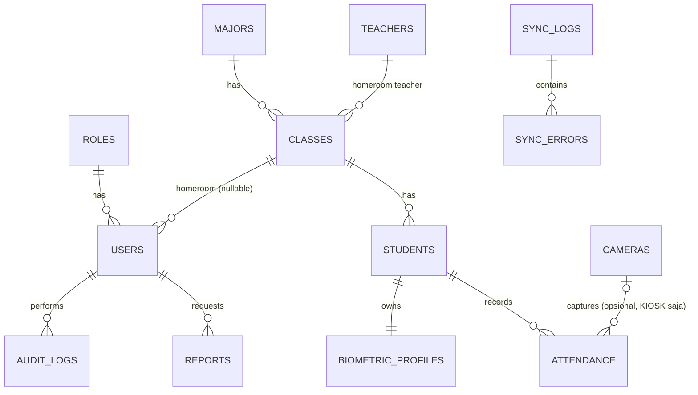

# 04 — Entity Relationship Design (ERD)
## Sistem Absensi Biometrik Sekolah — PostgreSQL

Prinsip: PostgreSQL adalah source of truth. Tidak ada binary/foto besar disimpan di PostgreSQL — hanya `object_key`/metadata yang menunjuk ke Object Storage. Data biometrik dipisahkan ke tabel terisolasi dengan akses paling ketat.

---

## 1. Entity List & Struktur

### users
| Kolom | Tipe | Ket |
|---|---|---|
| id | uuid (PK) | |
| email | varchar unique | |
| password_hash | varchar | tidak pernah di-expose |
| full_name | varchar | |
| role_id | uuid (FK → roles.id) | |
| homeroom_class_id | uuid (FK → classes.id, nullable) | untuk WALI_KELAS |
| is_active | boolean default true | |
| last_login_at | timestamptz nullable | |
| created_at / updated_at | timestamptz | |
| deleted_at | timestamptz nullable | soft delete |

Index: unique(email), index(role_id).

### roles
| Kolom | Tipe | Ket |
|---|---|---|
| id | uuid (PK) | |
| code | varchar unique | SUPER_ADMIN, ADMIN, OPERATOR, WALI_KELAS, VIEWER |
| description | text | |

### majors (jurusan)
| Kolom | Tipe | Ket |
|---|---|---|
| id | uuid (PK) | |
| external_id | varchar unique nullable | dari sistem eksternal |
| name | varchar | |
| code | varchar unique | |
| created_at / updated_at | timestamptz | |
| deleted_at | timestamptz nullable | |

### classes (kelas)
| Kolom | Tipe | Ket |
|---|---|---|
| id | uuid (PK) | |
| external_id | varchar unique nullable | |
| name | varchar | mis. "XII RPL 1" |
| major_id | uuid (FK → majors.id) | |
| homeroom_teacher_id | uuid (FK → teachers.id, nullable) | |
| created_at / updated_at | timestamptz | |
| deleted_at | timestamptz nullable | |

Index: index(major_id), index(homeroom_teacher_id).

### teachers (guru)
| Kolom | Tipe | Ket |
|---|---|---|
| id | uuid (PK) | |
| external_id | varchar unique nullable | |
| full_name | varchar | |
| nip | varchar unique nullable | |
| user_id | uuid (FK → users.id, nullable) | jika guru punya akun login |
| created_at / updated_at | timestamptz | |
| deleted_at | timestamptz nullable | |

### students (siswa)
| Kolom | Tipe | Ket |
|---|---|---|
| id | uuid (PK) | |
| external_id | varchar unique nullable | |
| nisn | varchar unique | |
| full_name | varchar | |
| class_id | uuid (FK → classes.id) | |
| gender | varchar nullable | |
| photo_object_key | varchar nullable | referensi ke Object Storage (foto tampilan, bukan biometrik) |
| is_active | boolean default true | |
| created_at / updated_at | timestamptz | |
| deleted_at | timestamptz nullable | |

Index: unique(nisn), index(class_id), index(external_id).

### biometric_profiles
| Kolom | Tipe | Ket |
|---|---|---|
| id | uuid (PK) | |
| student_id | uuid (FK → students.id) unique | 1:1 dengan student |
| embedding_ref | varchar | referensi ke penyimpanan embedding terenkripsi (bukan kolom biner besar langsung — lihat 06-SECURITY-SPEC) |
| embedding_version | varchar | versi model yang menghasilkan embedding |
| source_type | varchar | MANUAL_UPLOAD / BATCH_UPLOAD — asal foto softfile enrolment, untuk audit |
| enrolled_at | timestamptz | |
| is_active | boolean default true | |
| created_at / updated_at | timestamptz | |

Tabel ini memiliki kebijakan akses terpisah (row-level security / schema terpisah) — lihat 06-SECURITY-SPEC.md. Tidak pernah di-join langsung ke query yang hasilnya dikirim ke frontend.

### cameras
**Opsional** — hanya terisi kalau sekolah memakai kios/kamera bersama tepercaya (channel `KIOSK`). Jalur presensi utama (HP pribadi siswa, channel `STUDENT_PHONE`) tidak memakai tabel ini sama sekali.

| Kolom | Tipe | Ket |
|---|---|---|
| id | uuid (PK) | |
| name | varchar | mis. "Kios Gerbang A" (kalau dipakai) |
| location | varchar | |
| api_key_hash | varchar | untuk autentikasi kamera |
| status | varchar | ONLINE / OFFLINE |
| last_seen_at | timestamptz nullable | |
| resolution | varchar nullable | |
| fps | int nullable | |
| created_at / updated_at | timestamptz | |
| deleted_at | timestamptz nullable | |

### attendance_settings
| Kolom | Tipe | Ket |
|---|---|---|
| id | uuid (PK) | |
| class_id | uuid (FK → classes.id, nullable) | null = default sekolah |
| check_in_start_minutes | int | menit sejak tengah malam WIB (bukan kolom TIME — lihat catatan implementasi di schema.prisma soal ambiguitas timezone driver) |
| check_in_late_after_minutes | int | menit sejak tengah malam WIB |
| match_threshold | numeric | ambang skor kecocokan, default 0.90 (90%) |
| created_at / updated_at | timestamptz | |

### attendance
| Kolom | Tipe | Ket |
|---|---|---|
| id | uuid (PK) | |
| student_id | uuid (FK → students.id) | |
| camera_id | uuid (FK → cameras.id, **nullable**) | null = presensi via HP pribadi siswa (channel STUDENT_PHONE, jalur utama); terisi hanya untuk channel KIOSK |
| channel | varchar | STUDENT_PHONE (default, jalur utama) / KIOSK (opsional) |
| match_score | numeric | |
| liveness_passed | boolean | |
| status | varchar | ON_TIME / LATE / MANUAL |
| recorded_at | timestamptz | waktu kejadian presensi |
| attendance_date | date | tanggal kalender WIB (bukan UTC — lihat catatan di schema.prisma soal bug pergantian hari yang pernah terjadi), dipakai untuk unique constraint di bawah |
| created_at | timestamptz | waktu tersimpan di sistem |
| idempotency_key | varchar unique | mencegah double-submit dari HP siswa (retry jaringan/tap ganda) menghasilkan dua baris |

Index: index(student_id, recorded_at), index(camera_id, recorded_at), index(status). **Unique constraint `(student_id, attendance_date)`** — bukan opsional, ditegakkan di level database untuk mencegah race condition saat banyak siswa check-in bersamaan (lihat FR-ATTENDANCE-003, dan penanganan error P2002 di kode).

### sync_logs
| Kolom | Tipe | Ket |
|---|---|---|
| id | uuid (PK) | |
| entity_type | varchar | students / classes / majors / teachers |
| sync_type | varchar | FULL / INCREMENTAL |
| status | varchar | RUNNING / SUCCESS / PARTIAL / FAILED |
| started_at | timestamptz | |
| finished_at | timestamptz nullable | |
| total_records | int | |
| success_count | int | |
| failed_count | int | |

### sync_errors
| Kolom | Tipe | Ket |
|---|---|---|
| id | uuid (PK) | |
| sync_log_id | uuid (FK → sync_logs.id) | |
| external_id | varchar | |
| error_message | text | |
| payload_snapshot | jsonb | |
| retried | boolean default false | |
| created_at | timestamptz | |

### audit_logs
| Kolom | Tipe | Ket |
|---|---|---|
| id | uuid (PK) | |
| actor_user_id | uuid (FK → users.id, nullable) | null jika sistem |
| action | varchar | mis. STUDENT_UPDATE, ROLE_CHANGE, EXPORT_REPORT |
| entity_type | varchar | |
| entity_id | varchar | |
| before_snapshot | jsonb nullable | |
| after_snapshot | jsonb nullable | |
| ip_address | varchar nullable | |
| created_at | timestamptz | |

Index: index(actor_user_id), index(entity_type, entity_id), index(created_at).

### reports
| Kolom | Tipe | Ket |
|---|---|---|
| id | uuid (PK) | |
| requested_by | uuid (FK → users.id) | |
| type | varchar | ATTENDANCE_EXPORT dst |
| filter_params | jsonb | |
| status | varchar | PENDING / PROCESSING / DONE / FAILED |
| object_key | varchar nullable | lokasi file hasil di Object Storage |
| expires_at | timestamptz nullable | |
| created_at / updated_at | timestamptz | |

## 2. Cardinality Ringkas

- majors 1—N classes
- classes 1—N students
- classes 1—1 teachers (homeroom, nullable)
- students 1—1 biometric_profiles
- students 1—N attendance
- cameras 0/1—N attendance (nullable — hanya terisi untuk channel KIOSK, mayoritas attendance channel STUDENT_PHONE punya camera_id null)
- users 1—N audit_logs (sebagai actor)
- sync_logs 1—N sync_errors

## 3. ERD Mermaid

## 4. Kebijakan Khusus

- Tidak ada foto/gambar biner besar disimpan di kolom PostgreSQL — `photo_object_key` dan `object_key` hanya menyimpan referensi string ke Object Storage.
- `biometric_profiles.embedding_ref` tidak menyimpan embedding mentah dalam kolom biasa yang dapat di-select bebas — nilainya adalah string hasil enkripsi **AES-256-GCM** yang dilakukan oleh Face Service (bukan oleh APP/PostgreSQL). APP menyimpan string ini apa adanya, tidak pernah mendekripsinya sendiri (lihat 06-SECURITY-SPEC.md, resolusi OQ-SEC-01).
- Soft delete (`deleted_at`) digunakan pada entity master (users, students, classes, majors, teachers, cameras) agar riwayat kehadiran historis tetap valid meski record induk dinonaktifkan.
- `external_id` wajib ada pada entity yang berasal dari sinkronisasi sistem sekolah eksternal (students, classes, majors, teachers) untuk mendukung upsert idempotent.
- `biometric_profiles` tidak menyimpan referensi ke foto softfile sumber sama sekali — foto enrolment bersifat sementara dan dihapus permanen setelah embedding dibuat (lihat 06-SECURITY-SPEC.md), sehingga tidak ada kolom `source_photo_object_key` yang bertahan pasca-enrolment.

## OPEN QUESTIONS

- OQ-ERD-01: Apakah diperlukan tabel `attendance_evidence` terpisah untuk menyimpan snapshot gambar bukti presensi (bukan biometrik) di Object Storage — belum ada keputusan resmi dari sekolah soal kebutuhan bukti visual. Catatan: untuk channel STUDENT_PHONE, ini akan berkonflik dengan FR-CHECKIN-005 (foto check-in tidak boleh disimpan) — kalau dibutuhkan, perlu keputusan eksplisit yang melonggarkan aturan itu, bukan diam-diam ditambahkan.
- ~~OQ-ERD-02: Skema enkripsi kolom untuk `biometric_profiles`~~ — **RESOLVED**: AES-256-GCM, dilakukan oleh Face Service (bukan di level database/KMS terpisah). Lihat `face-service/app/security.py`.
