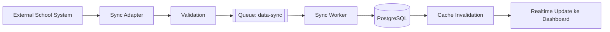

# 07 — Synchronization Specification
## Sistem Absensi Biometrik Sekolah

---

## 1. Tujuan

Menjaga data master (students, classes, majors, teachers, homeroom teacher) tetap konsisten dengan sistem sekolah eksternal (mis. Dapodik/SIS internal), tanpa mengasumsikan struktur API pihak eksternal tertentu (lihat aturan #3).

## 2. Alur Sinkronisasi

- **Sync Adapter**: lapisan abstraksi yang menerjemahkan format data sistem eksternal (apa pun bentuknya — REST, CSV export, dsb.) menjadi kontrak internal standar (DTO). Adapter dapat diganti tanpa mengubah domain logic (aturan #5).
- **Validation**: memverifikasi field wajib (external_id, nama, dsb.), menolak record tidak valid ke `sync_errors` tanpa menghentikan seluruh batch.
- **Queue**: setiap batch/record dikirim sebagai job ke queue `data-sync` agar tidak blocking HTTP request yang memicu sinkronisasi (FR-SYNC-001).
- **Sync Worker**: melakukan upsert ke PostgreSQL berdasarkan `external_id`.
- **Cache Invalidation**: setelah commit, cache terkait (mis. `students:{id}`, `classes:list`) diinvalidasi.
- **Realtime Update**: dashboard yang menampilkan data master ter-refresh (opsional, prioritas lebih rendah dari update attendance).

## 3. Entity yang Disinkronkan

students, classes, majors, teachers, homeroom teacher assignment (bagian dari classes).

## 4. Kontrak Field Minimum

Setiap entity sinkronisasi wajib membawa:
- `external_id` (identifier dari sistem sumber)
- `source_system` (nama/identifier sistem asal, untuk mendukung multi-sumber di masa depan)
- `last_synced_at` (di-set oleh sync worker saat commit)
- `sync_status` (SYNCED / FAILED / PENDING pada level record, disimpan di entity atau ditelusuri via sync_logs/sync_errors)

## 5. Full Sync vs Incremental Sync

- **Full Sync** (FR-SYNC-001): mengambil seluruh data dari sumber eksternal, melakukan upsert massal. Digunakan untuk sinkronisasi awal atau pemulihan setelah inkonsistensi besar. Dijalankan di luar jam sibuk (idealnya di luar jam masuk sekolah).
- **Incremental Sync** (FR-SYNC-002): mengambil data yang berubah sejak `last_synced_at` terakhir yang sukses. Digunakan untuk sinkronisasi terjadwal rutin (mis. tiap jam atau tiap malam — jadwal pasti OPEN QUESTION).

## 6. Idempotency & Upsert (FR-SYNC-003, FR-SYNC-005)

- Operasi upsert menggunakan `external_id` sebagai kunci konflik (`ON CONFLICT (external_id) DO UPDATE` via Prisma).
- Menjalankan ulang sesi sinkronisasi yang sama (mis. retry setelah worker crash di tengah proses) tidak boleh menghasilkan duplikasi — setiap job sinkronisasi per record bersifat idempotent karena berbasis upsert, bukan insert murni.
- **Larangan penting**: sistem TIDAK BOLEH menghapus data lokal secara otomatis hanya karena record tersebut tidak muncul sementara dari sistem eksternal (aturan #16 & requirement eksplisit). Penghapusan data lokal hanya terjadi melalui aksi eksplisit admin (soft delete manual) atau mekanisme "tombstone" resmi dari sumber eksternal jika tersedia — bukan inferensi dari ketidakhadiran record.

## 7. Retry & Conflict Handling

- Record yang gagal divalidasi/disimpan dicatat ke `sync_errors` dengan snapshot payload, tidak menghentikan proses batch lain (FR-SYNC-004).
- Retry manual: admin dapat memicu ulang record gagal tertentu dari `sync_errors` melalui UI/endpoint terkait (turunan dari `GET /api/sync/logs`).
- Retry otomatis: job level queue menggunakan backoff eksponensial standar BullMQ untuk kegagalan transient (timeout jaringan ke sumber eksternal), dibedakan dari kegagalan validasi data (yang tidak di-retry otomatis karena butuh perbaikan data sumber).
- Conflict data (mis. dua sumber field NISN berbeda dari `external_id` sama) dicatat sebagai error dan memerlukan resolusi manual admin — sistem tidak menebak/menimpa data secara diam-diam.

## 8. Sync History & Observability

Setiap sesi sinkronisasi tercatat di `sync_logs` (status, total, sukses, gagal, waktu mulai/selesai) dan dapat ditelusuri melalui `GET /api/sync/status` dan `GET /api/sync/logs` (lihat 05-API-SPEC.md).

## OPEN QUESTIONS

- OQ-SYNC-01: Struktur/protokol API sistem sekolah eksternal belum diketahui — Sync Adapter didesain sebagai interface, implementasi konkret menunggu detail sistem sumber (aturan #3).
- OQ-SYNC-02: Jadwal incremental sync (interval pasti) belum ditentukan oleh sekolah.
- OQ-SYNC-03: Mekanisme "tombstone"/penghapusan resmi dari sumber eksternal (jika ada) belum diketahui bentuknya.
