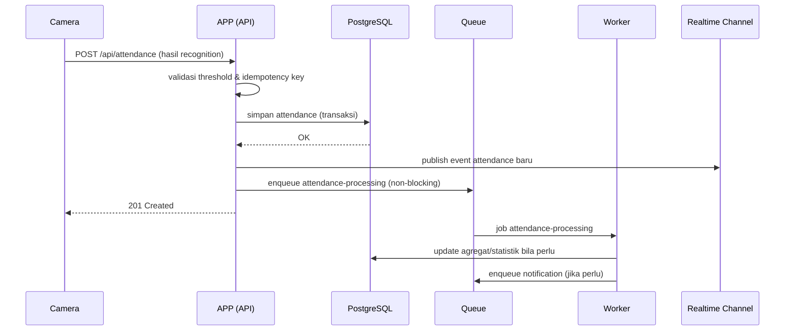

# 09 — Queue & Worker Specification
## Sistem Absensi Biometrik Sekolah

Prinsip: pekerjaan berat tidak boleh blocking HTTP request. Queue bukan database utama — hanya media transport pekerjaan asinkron, hasil akhir selalu ditulis ke PostgreSQL/Object Storage.

---

## 1. Daftar Queue

### attendance-processing
- **Payload**: `{ attendanceId, studentId, cameraId, recordedAt }` — `cameraId` nullable (null untuk channel STUDENT_PHONE, jalur presensi utama; terisi hanya untuk channel KIOSK opsional).
- **Kegunaan**: pekerjaan turunan setelah attendance inti tersimpan (mis. update statistik agregat, trigger notifikasi jika diperlukan) — bukan penyimpanan attendance itu sendiri (itu terjadi sinkron di API agar data konsisten cepat).
- **Retry**: 3x, exponential backoff (1s, 5s, 30s).
- **Timeout**: 10 detik per job.
- **Concurrency**: 10 job paralel per worker instance.
- **Idempotency**: berbasis `attendanceId` — job yang diproses ulang tidak boleh mengirim notifikasi ganda (cek status sebelum aksi efek samping).
- **Priority**: tinggi (mendekati realtime).
- **Failure handling**: setelah 3x gagal, job masuk dead-letter queue dan memicu alert observability.

### notification
- **Payload**: `{ type, recipient, templateId, data, dedupeKey }`
- **Retry**: 5x, exponential backoff (5s, 30s, 2m, 10m, 30m).
- **Timeout**: 15 detik.
- **Concurrency**: 5 job paralel.
- **Idempotency**: `dedupeKey` (mis. attendanceId+recipient) mencegah notifikasi duplikat saat retry.
- **Priority**: normal.
- **Failure handling**: dead-letter setelah retry habis, tercatat untuk audit (notifikasi gagal terkirim, bukan silent fail).

### report-generation
- **Payload**: `{ reportId, requestedBy, type, filterParams }`
- **Retry**: 2x, backoff 30s, 2m.
- **Timeout**: 5 menit (proses generate PDF bisa memakan waktu untuk data besar).
- **Concurrency**: 2 job paralel per worker (I/O & CPU intensif).
- **Idempotency**: berbasis `reportId` — job yang diproses ulang menimpa hasil sebelumnya (upload ulang ke object key yang sama), bukan membuat file duplikat.
- **Priority**: rendah.
- **Failure handling**: status `reports.status = FAILED` setelah retry habis, admin dapat memicu ulang manual.

### data-sync
- **Payload**: `{ syncLogId, entityType, mode, batchRef }`
- **Retry**: 3x untuk kegagalan transient (timeout jaringan), tidak di-retry otomatis untuk kegagalan validasi data (dicatat ke `sync_errors` untuk retry manual).
- **Timeout**: adaptif sesuai ukuran batch (default 2 menit per batch).
- **Concurrency**: 1 job aktif per `entityType` (dilindungi distributed lock `lock:sync:{entityType}` — lihat 08-CACHE-SPEC.md) untuk mencegah race condition upsert.
- **Idempotency**: upsert berbasis `external_id` (lihat 07-SYNC-SPEC.md).
- **Priority**: normal, dijadwalkan di luar jam sibuk untuk full sync.
- **Failure handling**: batch gagal dicatat di `sync_logs`/`sync_errors`, tidak menghentikan batch lain.

### face-processing *(tidak diimplementasikan — lihat catatan)*
**Catatan penting**: queue ini ada di rencana awal, TAPI implementasi aktual TIDAK memakainya. Perbandingan wajah saat check-in (`POST /api/attendance/checkin`) dilakukan **SINKRON** — APP memanggil Face Service langsung via HTTP dan menunggu hasilnya dalam request yang sama — BUKAN lewat queue asinkron, karena siswa butuh jawaban instan ("hadir"/"gagal") di HP-nya, bukan notifikasi belakangan. Payload di bawah ini dipertahankan sebagai referensi desain awal, bukan kontrak yang diimplementasikan:
- **Payload (rencana awal, tidak dipakai)**: `{ requestId, cameraId, imageRef atau embeddingRef }`.
- Kalau di masa depan throughput check-in sangat tinggi sehingga panggilan sinkron ke Face Service jadi bottleneck, queue ini bisa diaktifkan kembali sebagai optimasi — belum dibutuhkan di skala saat ini (satu sekolah).

### face-enrollment
- **Payload**: `{ enrollmentId, studentId, tempObjectKey, source: "MANUAL" | "BATCH" }` — `tempObjectKey` menunjuk ke foto softfile sementara di bucket enrolment terisolasi.
- **Kegunaan**: memproses foto softfile hasil upload (manual atau batch) menjadi embedding biometrik (FR-ENROLL-001..006).
- **Langkah wajib dalam job**: (1) validasi kualitas foto (satu wajah, resolusi, blur), (2) generate embedding jika lolos, (3) simpan ke `biometric_profiles`, (4) **hapus permanen `tempObjectKey` dari Object Storage** — langkah ini dijalankan baik job berhasil maupun gagal, dan job tidak dianggap selesai sebelum penghapusan terkonfirmasi (FR-ENROLL-005, NFR-SEC-004).
- **Retry**: 1x untuk kegagalan transient (mis. timeout storage), TIDAK di-retry otomatis untuk kegagalan validasi kualitas foto (butuh foto baru dari admin).
- **Timeout**: 20 detik.
- **Concurrency**: sesuai kapasitas komputasi engine recognition, dipisah dari worker `attendance-processing` agar beban batch enrolment tidak mengganggu latensi presensi realtime.
- **Idempotency**: berbasis `enrollmentId` — retry tidak boleh membuat embedding ganda (upsert ke `biometric_profiles` berdasarkan `student_id` unique) dan tidak boleh gagal menghapus foto sumber hanya karena job diproses ulang.
- **Priority**: rendah–normal (bukan realtime, tidak boleh mengantre di depan `attendance-processing`).
- **Failure handling**: kegagalan tercatat di audit log (ENROLLMENT_FAILED) dengan alasan (kualitas foto, wajah tidak terdeteksi, dsb.) tanpa foto/embedding di detail log; foto sumber tetap dihapus meski job gagal.

## 2. Flow Attendance End-to-End

Poin penting: penyimpanan attendance inti terjadi SINKRON di request API (agar data langsung menjadi source of truth dan dashboard realtime akurat), sedangkan pekerjaan turunan (notifikasi, agregasi berat) di-offload ke queue agar tidak menambah latensi respons ke kamera.

## 3. Prinsip Umum Semua Queue

- Semua job HARUS idempotent (NFR-REL-001) — pemrosesan ulang tidak boleh menghasilkan efek samping ganda.
- Semua job memiliki timeout eksplisit agar tidak menahan worker slot tanpa batas.
- Dead-letter queue wajib dipantau (lihat 12-OPERATIONS.md) — job yang gagal permanen tidak boleh hilang begitu saja tanpa jejak.
- Worker bersifat stateless dan dapat diskalakan horizontal secara independen dari APP.

## OPEN QUESTIONS

- ~~OQ-QUEUE-01: Kapasitas komputasi untuk queue `face-processing`~~ — **MOOT**: queue ini tidak diimplementasikan (lihat catatan di bagian face-processing di atas) — perbandingan wajah saat check-in dilakukan sinkron via HTTP ke Face Service (InsightFace + MiniFASNet, CPU-only, tidak butuh GPU — lihat `face-service/README.md`), bukan lewat queue asinkron.
