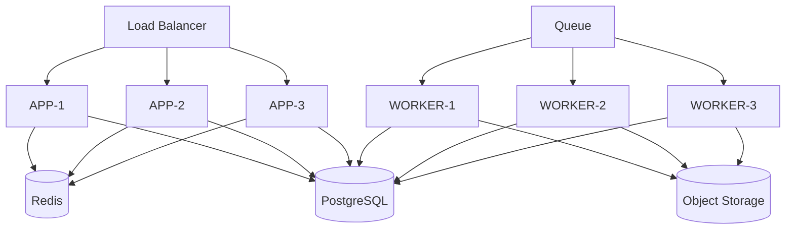

# 15 — Infrastructure Specification
## Sistem Absensi Biometrik Sekolah

> Catatan penomoran: dokumen ini awalnya diminta dengan nama `08-INFRASTRUCTURE-SPEC.md`, yang bertabrakan dengan `08-CACHE-SPEC.md` (Bagian 9 pada prompt asal). Untuk menghindari duplikasi nomor file, dokumen ini diberi nomor `15`. Lihat `README.md` bagian "Keputusan Penomoran Dokumen".

Mencakup Bagian 11 (Object Storage) dan Bagian 12 (Infrastructure) dari spesifikasi asal.

---

## 1. Object Storage

**Kegunaan**: student photos (foto tampilan, bukan biometrik), attendance evidence (jika diaktifkan, lihat OQ-ERD-01), reports (hasil export), backup artifacts.

**Aturan wajib**:
- Bucket bersifat **private** — tidak ada akses publik langsung.
- Akses baca/tulis melalui **presigned URL** dengan masa berlaku singkat (default 15 menit untuk unggah, 1 jam untuk unduh laporan — nilai final OPEN QUESTION).
- **Access control**: kebijakan IAM terpisah per bucket (foto siswa vs laporan vs backup), least privilege per service.
- **File validation**: MIME type whitelist (image/jpeg, image/png untuk foto; application/pdf untuk laporan), validasi magic bytes, bukan hanya ekstensi.
- **Size limit**: foto siswa maksimum 5MB (nilai default, dapat dikonfigurasi), laporan PDF maksimum 50MB.
- Database (PostgreSQL) hanya menyimpan `object_key` dan metadata (nama file, ukuran, tipe, waktu upload) — **tidak pernah** binary file itu sendiri.
- **Untuk topologi on-prem mini PC** (lihat catatan §5 di bawah): jika Object Storage juga dijalankan lokal (mis. MinIO di mini PC yang sama), maka artifact di dalamnya WAJIB direplikasi/backup ke lokasi kedua dengan jadwal yang sama ketatnya dengan backup PostgreSQL — objek storage lokal bukan pengecualian dari kebutuhan portabilitas data.

## 2. Komponen Infrastruktur

| Komponen | Peran | Catatan |
|---|---|---|
| CDN | Distribusi asset statis frontend, cache edge | Provider-agnostic (abstraction layer, aturan #4) |
| Load Balancer | Distribusi trafik ke instance APP, TLS termination, health check | Mendukung horizontal scaling APP |
| Reverse Proxy | Routing internal, header normalization, opsional WAF | Dapat digabung dengan Load Balancer tergantung provider |
| Application Server (APP) | Menjalankan Next.js API + dashboard | Stateless, container-based |
| **Face Service** | **Microservice Python terpisah**: face embedding (InsightFace) + liveness (MiniFASNet) | Linux biasa, **tidak butuh GPU/Windows**, di server fisik terpisah dari APP (lihat §6), TIDAK diekspos ke internet publik |
| Worker | Menjalankan proses queue consumer | Stateless, container-based, scale terpisah dari APP |
| Redis | Cache, rate limit, queue backend | Subnet privat |
| PostgreSQL | Source of truth | Subnet privat, backup terjadwal |
| Object Storage | File/blob | S3-compatible, provider-agnostic |
| Network/Firewall | Segmentasi & pembatasan akses | Least privilege antar subnet |
| TLS | Enkripsi transport | Wajib end-to-end sampai ke APP minimal, **dan wajib antara APP↔Face Service kalau di server fisik berbeda** |
| DNS | Resolusi domain dashboard & API | Dikelola terpisah dari kode aplikasi |
| Container (Docker) | Unit deployment APP, Worker, dan Face Service | Image terpisah untuk masing-masing |
| Secrets | Kredensial & kunci | Secret manager, tidak pernah di repo (aturan #12). **Kunci enkripsi embedding (`EMBEDDING_ENCRYPTION_KEY`) di Face Service butuh perhatian ekstra** — kehilangannya membuat semua template biometrik tidak bisa didekripsi permanen (lihat 06-SECURITY-SPEC.md). |

## 3. Statelessness & Horizontal Scaling

Application (APP) harus stateless:
- Tidak menyimpan session di memori proses lokal — sesi divalidasi via Redis/PostgreSQL.
- Tidak menyimpan file upload sementara di disk lokal container secara permanen — hanya buffer sementara sebelum diteruskan ke Object Storage.
- Konfigurasi dimuat dari environment variable/secret manager, bukan file lokal yang berbeda per instance.

Penambahan instance APP-N atau WORKER-N tidak memerlukan perubahan kode — hanya perubahan konfigurasi orkestrasi (jumlah replica) dan registrasi ke Load Balancer/queue consumer group.

## 4. Provider Abstraction

Sesuai aturan #4 dan #5 pada instruksi asal, sistem tidak boleh mengasumsikan provider cloud tertentu. Abstraction layer wajib pada:
- Object Storage (interface S3-compatible, implementasi konkret dapat diganti: AWS S3, MinIO, dsb.)
- CDN (interface generik untuk invalidasi cache/serve asset)
- Secret Manager (interface generik untuk baca secret, implementasi dapat berupa Vault, cloud-native secret manager, atau environment variable terenkripsi pada tahap awal)

## 5. Topologi Aktual: Dua Server (cPanel + Face Service)

**Update setelah pemilihan hosting**: sekolah dan pengembang masing-masing menyediakan satu server (dua server total), dengan pembagian peran:

- **Server 1 (cPanel)**: menjalankan APP (Next.js). cPanel umumnya berjalan di **Linux** (dukungan cPanel-for-Windows sudah lama dihentikan) — Node.js didukung via fitur "Setup Node.js App" (Passenger/CloudLinux NodeJS Selector) di cPanel modern. **Keterbatasan yang perlu diperhitungkan**: cPanel shared/VPS hosting biasanya TIDAK didesain untuk proses long-running seperti Worker BullMQ atau koneksi persisten (SSE) — perlu dicek apakah paket hosting yang dipakai mendukung ini, atau apakah Worker perlu dijalankan di server 2 sebagai gantinya.
- **Server 2 (Face Service)**: menjalankan microservice Python (InsightFace + MiniFASNet) — Linux biasa, **tidak butuh GPU/Windows** (opsi vendor komersial yang butuh Windows Server sudah dieliminasi karena butuh lisensi berbayar — lihat 01-PRD.md §19 Dependencies).
- Redis dan PostgreSQL dapat dijalankan di salah satu dari dua server (rekomendasi: server 2, yang lebih mungkin punya akses root penuh dibanding cPanel shared hosting) — lihat OQ-INFRA-03 di bawah.

Komunikasi APP↔Face Service melewati jaringan ANTAR SERVER FISIK (bukan localhost) — **WAJIB TLS**, atau minimal jaringan privat/VPN antar keduanya, JANGAN HTTP polos di internet terbuka (lihat 03-SAD.md §6 Trust Boundary 3, dan 11-DEPLOYMENT.md §10).

## 6. Topologi Sebelumnya (Mini PC On-Premise) — Masih Berlaku Jika Relevan

Catatan sejarah: rencana awal (sebelum topologi §5 di atas dikonfirmasi) mengasumsikan satu unit mini PC on-premise di sekolah untuk seluruh stack. Kalau salah satu dari dua server di §5 KEBETULAN adalah mini PC yang bisa dipindah-pindah fisik (bukan VPS/hosting permanen), maka seluruh kewajiban di bawah ini TETAP BERLAKU untuk server tersebut:

- CDN dan Load Balancer multi-instance TIDAK relevan di skala ini — namun kontrak/abstraction layer tetap dipertahankan di kode agar migrasi ke topologi cloud multi-instance di masa depan tidak memerlukan penulisan ulang domain logic (aturan #4, #5).
- Kalau server bersifat portable secara fisik dan bisa dimatikan & dipindahkan sementara (mis. renovasi sekolah) — seluruh data HARUS dapat direkonstruksi penuh di perangkat lain hanya dari backup, tanpa bergantung pada disk fisik server yang sama.
- Detail prosedur backup, relokasi, dan verifikasi pasca-pindah ada di 11-DEPLOYMENT.md §6–8 dan 12-OPERATIONS.md §5–5.1.
- Rekomendasi: gunakan penyimpanan cloud sebagai lokasi kedua backup (bukan hanya media eksternal fisik) jika sekolah punya akses internet yang cukup stabil untuk unggah terjadwal.

## OPEN QUESTIONS

- OQ-INFRA-01: Provider hosting final (cloud/on-prem sekolah) belum ditentukan — memengaruhi pilihan implementasi konkret CDN/Load Balancer/Object Storage.
- OQ-INFRA-02: Nilai pasti masa berlaku presigned URL dan limit ukuran file final menunggu keputusan operasional.
- OQ-INFRA-03: Paket cPanel yang dipakai (shared vs VPS dengan akses root) belum dikonfirmasi — menentukan apakah Worker (BullMQ) dan koneksi SSE bisa berjalan di server 1, atau harus dipindah ke server 2. Kalau paket cPanel-nya shared hosting biasa (bukan VPS root), kemungkinan besar Worker dan bahkan Redis/PostgreSQL perlu dipindah ke server 2 sepenuhnya.
- OQ-INFRA-04: Mekanisme jaringan aman antara Server 1 (cPanel) dan Server 2 (Face Service) — VPN? IP whitelist di firewall? TLS mutual auth? — belum ditentukan, WAJIB diputuskan sebelum production (lihat 03-SAD.md OQ-SAD-03).
